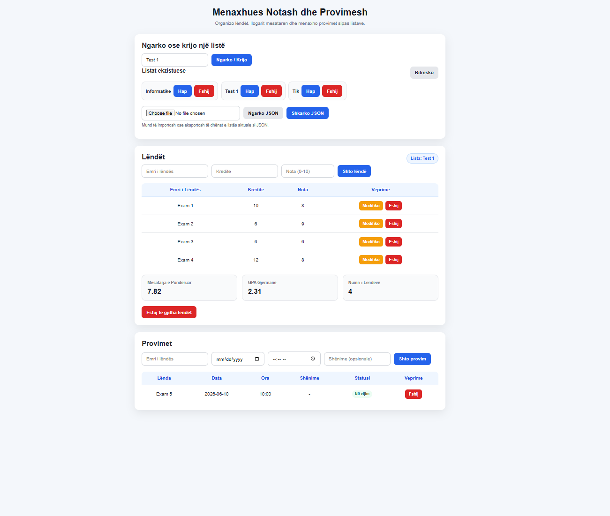

# Academic Tracker

A simple web app for managing subjects, grades, weighted average, German GPA, and exam dates.

## Features

- Create and load multiple lists
- Save data in localStorage
- Add, edit, and delete subjects
- Calculate weighted average
- Convert grades to German GPA
- Add, edit, and delete exams
- Sort exams by nearest date
- Import and export data as JSON

## Technologies

- HTML
- CSS
- JavaScript

## Screenshot

## How to use

1. Open `index.html` in your browser.
2. Create or load a list.
3. Add subjects with credits and grades.
4. Add exams with date, time, and notes.
5. Export or import the data as JSON.